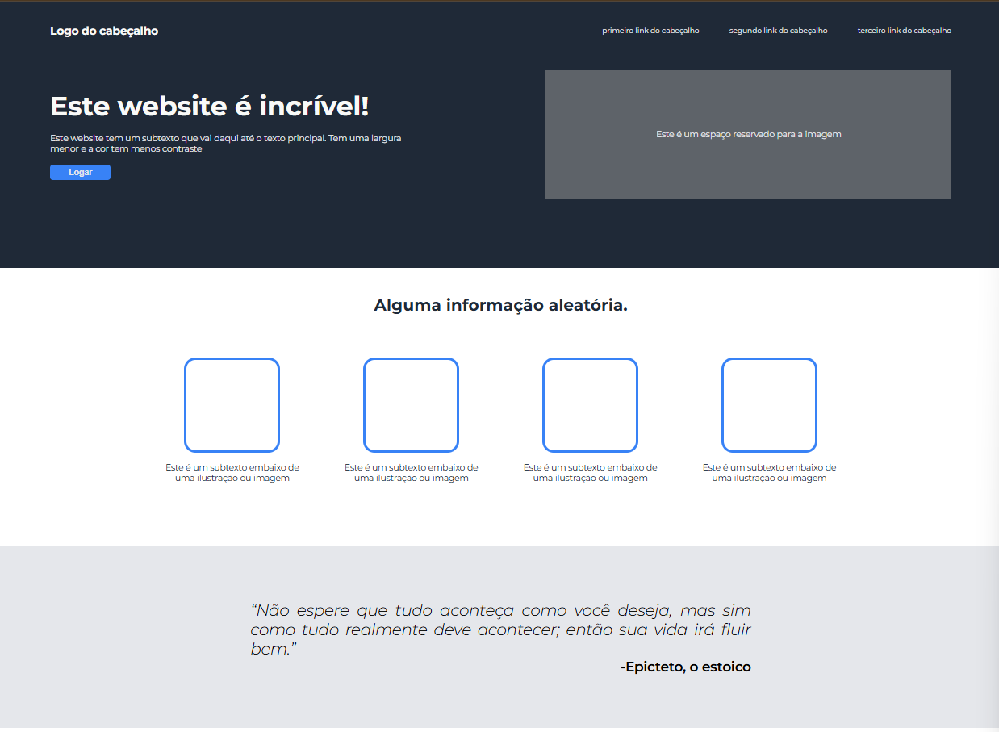

<h2>
  Landing Page estática desenvolvida como parte do currículo do
  <b>The Odin Project</b>.
</h2>

<h3>
  O projeto foca na aplicação de conceitos básicos de HTML e CSS para criar uma
  página responsiva e visualmente organizada.
</h3>

  

<h2>Características Implementadas:</h2>
<ul>
  <li>Layout responsivo para diferentes tamanhos de tela</li>
  <li>Estrutura semântica HTML5</li>
  <li>Estilização com CSS3 incluindo Flexbox/Grid</li>
  <li>Organização clara de conteúdo e seções</li>
  <li>Design visualmente atraente e funcional</li>
</ul>

<h2>Tecnologias Utilizadas:</h2>
<ul>
  <li>HTML5: Estrutura semântica da página</li>
  <li>CSS3: Estilização, layout responsivo e efeitos visuais</li>
</ul>

<h3>
  O projeto demonstra a aplicação prática dos fundamentos de desenvolvimento web
  front-end com foco em estruturação e design.
</h3>

  Desenvolvido com ❤️ por <b>Davi Teles de Moraes</b> - Contribuições são
  bem-vindas!

